# Procesverslag
Markdown is een simpele manier om HTML te schrijven.  
Markdown cheat cheet: [Hulp bij het schrijven van Markdown](https://github.com/adam-p/markdown-here/wiki/Markdown-Cheatsheet).

Nb. De standaardstructuur en de spartaanse opmaak van de README.md zijn helemaal prima. Het gaat om de inhoud van je procesverslag. Besteedt de tijd voor pracht en praal aan je website.

Nb. Door *open* toe te voegen aan een *details* element kun je deze standaard open zetten. Fijn om dat steeds voor de relevante stuk(ken) te doen.

## Jij

  
uitwerken voor kick-off werkgroep

  ### Auteur:
    Kaj-Benjamin Sitanala
  #### Je startniveau:
    Rood

  #### Je focus:
    Surface plane 

## Je website

  
uitwerken voor kick-off werkgroep

  ### Je opdracht:
Dunkin Donuts:
https://www.dunkin.nl
  #### Screenshot(s) van de eerste pagina (small screen): 
Homepage  
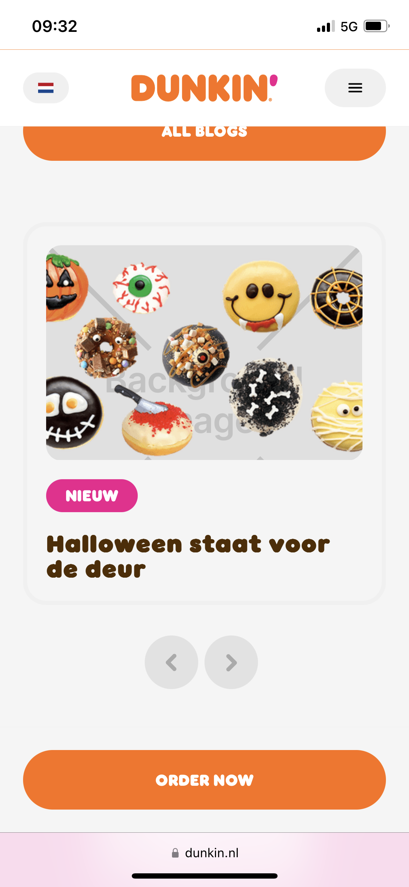
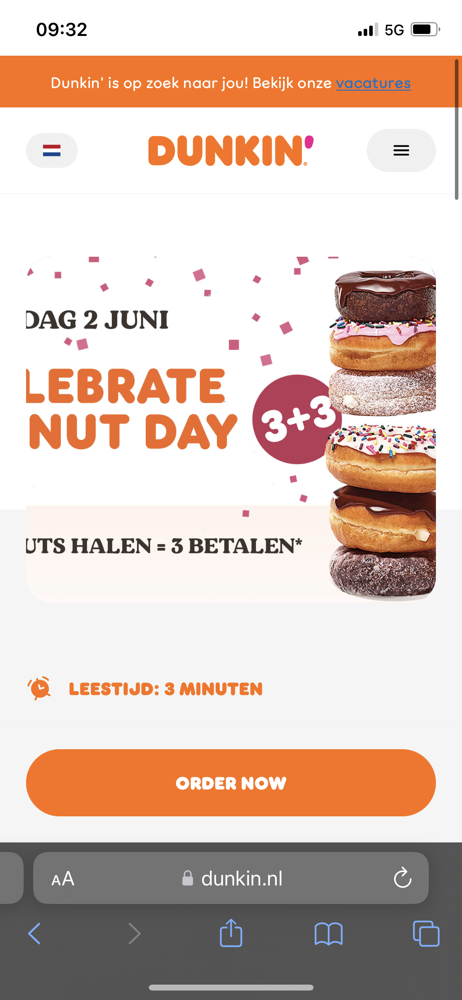
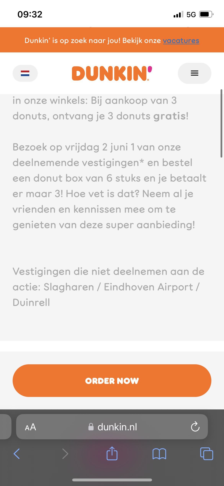

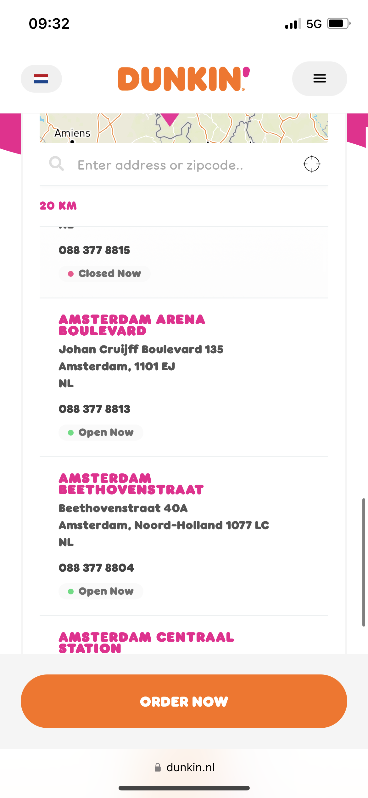
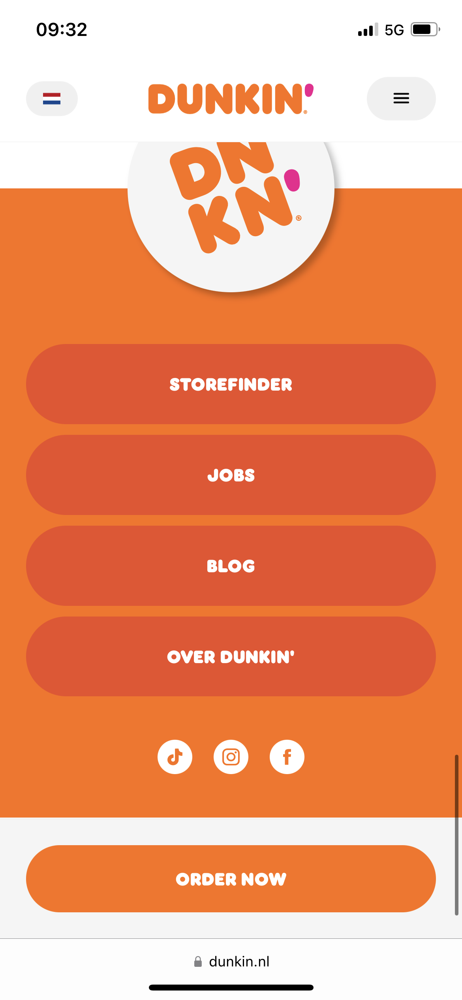
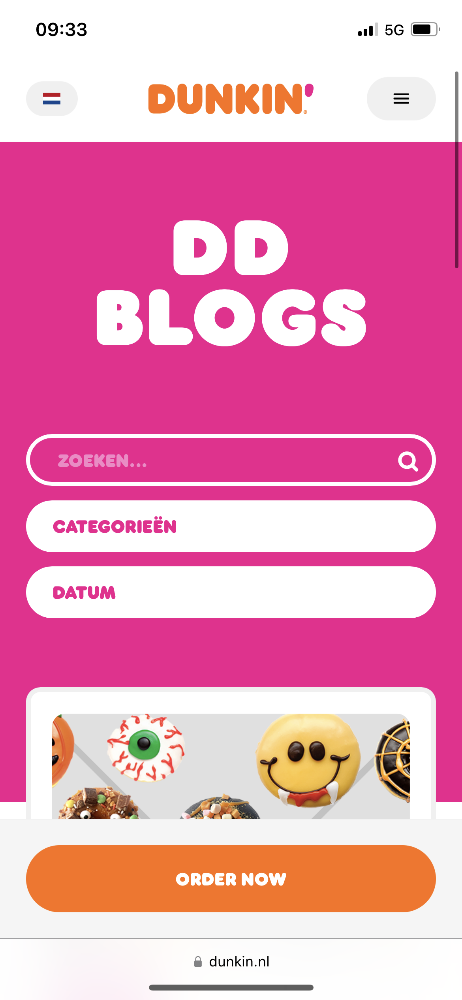
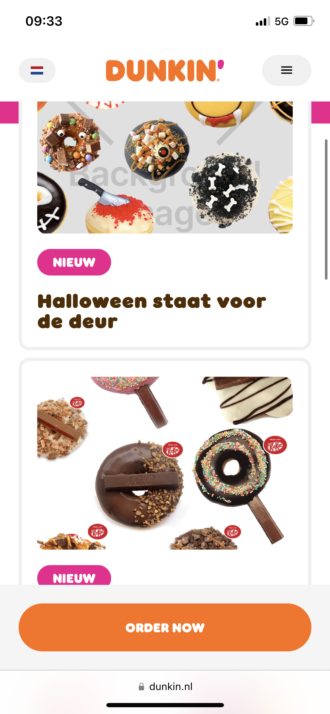
  #### Screenshot(s) van de tweede pagina (small screen):
Focus pagina  
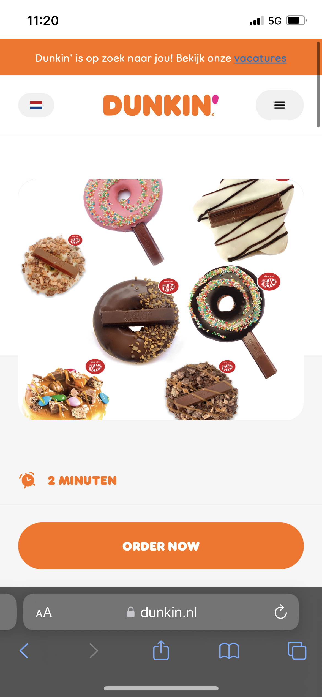
  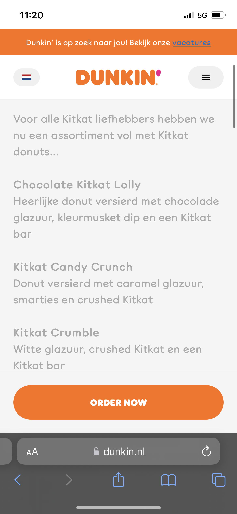
  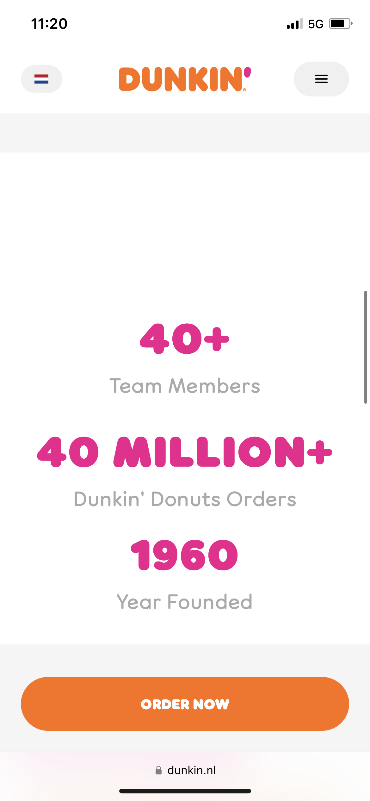
  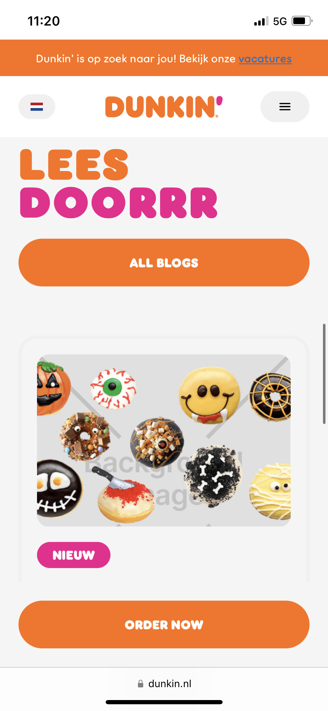
  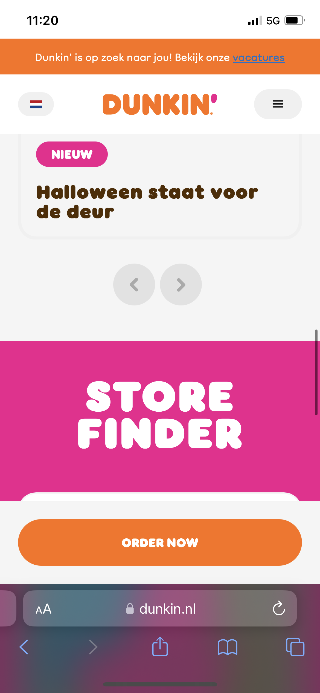
  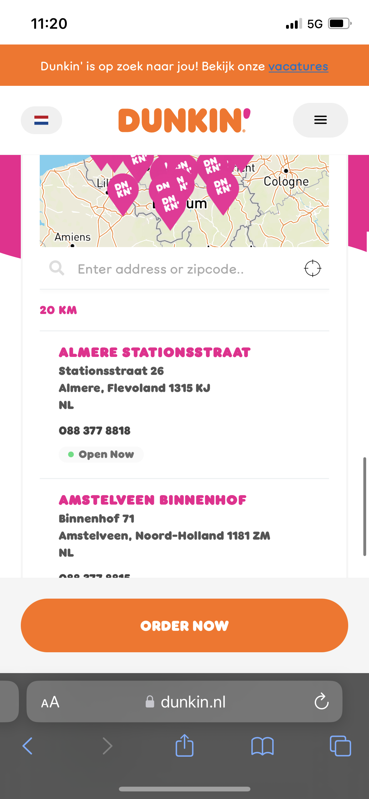
            
 

## Toegankelijkheidstest 1/2 (week 1)

  
uitwerken na test in 2e werkgroep

  ### Bevindingen
  Lijst met je bevindingen die in de test naar voren kwamen:
De dunkin Donuts site heeft veel mankementen, zoals de volgenden:
- Alles lijkt kwa :hover state op een button, ook plaatjes en kleine blokken hebben hetzelfde effect als buttons.
- Er waren heeeel veel errors in hun html
- De keyboard focus ging niet chronologisch
- Er zijn in de nav een paar knoppen die niet genoeg ruimte hebben als spacing
- Er zijn geen headings 
- geen h1
- geen li items
- geen alt tekst
- tekst in img werd niet vertaald door alt tekst
- linkjes worden niet aangekaart als link
- geen dark mode
- geen high contrast
- functionaliteit wordt niet alleen weergegeven door kleur, maar alles heeft dezelfde hover state dus 
je kan alsnog niet zien wat een knop is en wat niet

## Breakdownschets (week 1)

  
uitwerken na afloop 3e werkgroep

  ### de hele pagina: 
  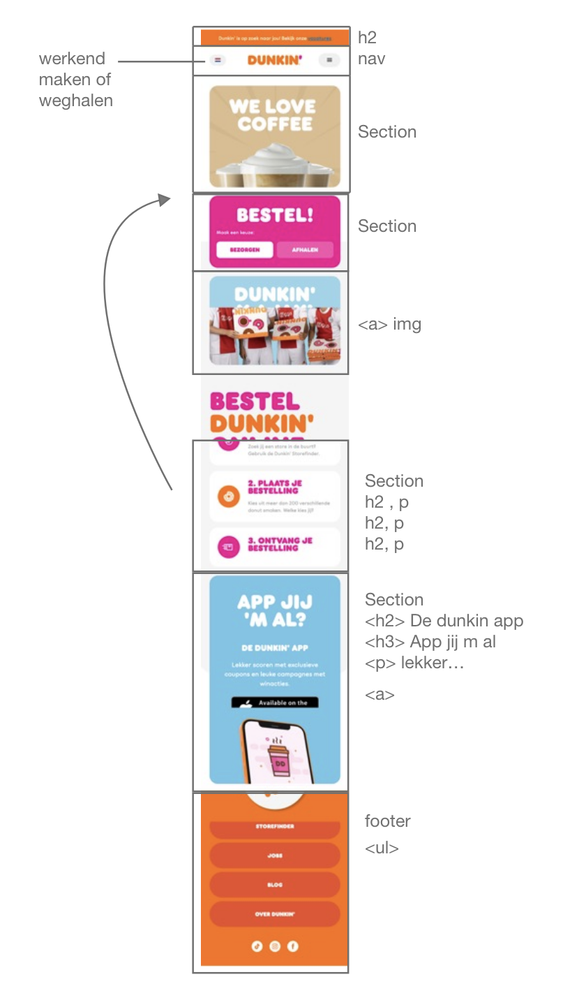

  ### dynamisch deel (bijv menu): 
  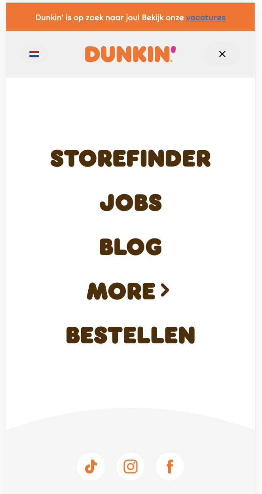

## Voortgang 1 (week 2)

  
uitwerken voor 1e voortgang

  ### Stand van zaken
Ik vond het erg lastig om een weg te vinden in waar ik moest beginnen, vooral bij het maken van een layout.

  ### Agenda voor meeting
  samen met je groepje opstellen

  | student 1      | student 2          | student 3    | student 4        |
  | ---            | ---                | ---          | ---              |
  | dit bespreken  | en dit             | en ik dit    | en dan ik dat    |
  | en dat ook nog | dit als er tijd is | nog een punt | dit wil ik zeker |
  | ...            | ...                | ...          | ...              |

  ### Verslag van meeting
  hier na afloop snel de uitkomsten van de meeting vastleggen

  - punt 1: alles was in orde, ook kon ik gaan beginnen, er was meer uitleg over grids waar 
  ik nu voor de eerste keer aan kan gaan werken
  - punt 2:
  Verder is er nog niet echt zekerheid in hoe ik verder moet, maarja ik moet nog beginnen.
  - nog een punt
  - ...

## Voortgang 2 (week 3)

  
uitwerken voor 2e voortgang

  ### Stand van zaken
  hier dit ging goed & dit was lastig (neem ook screenshots op van delen van je website en code)

Ik heb mijn html al zo goed als af, toch moet ik alles met css goed gaan ordenen.

  ### Agenda voor meeting
  samen met je groepje opstellen

  | student 1      | student 2          | student 3    | student 4        |
  | ---            | ---                | ---          | ---              |
  | dit bespreken  | en dit             | en ik dit    | en dan ik dat    |
  | en dat ook nog | dit als er tijd is | nog een punt | dit wil ik zeker |
  | ...            | ...                | ...          | ...              |

  ### Verslag van meeting
  hier na afloop snel de uitkomsten van de meeting vastleggen

  - punt 1:
  Ik heb een begin gemaakt met css, dit moet natuurlijk veel meer uitgebreidt worden.
  - punt 2:
  Ik heb een goede basis gemaakt met grids en hiermee werken gaat steeds beter.
  - nog een punt
- ...

## Toegankelijkheidstest 2/2 (week 4)

  
uitwerken na test in 9e werkgroep

  ### Bevindingen
  Lijst met je bevindingen die in de test naar voren kwamen (geef ook aan wat er verbeterd is):

  Hier de lijst van de eerste toegankelijkheids test:
- Er waren heeeel veel errors in hun html
- De keyboard focus ging niet chronologisch
- Er zijn in de nav een paar knoppen die niet genoeg ruimte hebben als spacing
- Er zijn geen headings 
- geen h1
- geen li items
- geen alt tekst
- tekst in img werd niet vertaald door alt tekst
- linkjes worden niet aangekaart als link
- geen dark mode
- geen high contrast
- functionaliteit wordt niet alleen weergegeven door kleur, maar alles heeft dezelfde hover state dus 
je kan alsnog niet zien wat een knop is en wat niet

Wat heb ik verbeterd:
-Ik heb weinig tot geen error in mijn html
- als het goed is kan je met screenreader er goed doorheen
- genoeg spacing in mijn nav
- ik heb headings gebruikt
- ik heb alles een alt tekst gegeven en het wordt in het NL voorgelezen.
- alle linkjes worden vertaalt als linkjes
- ik heb een minimalistische dark mode gemaakt die werkt
- high contrast heb ik helaas niet gemaakt
- ik heb niet alles een hover state gegeven.

## Voortgang 3 (week 4)

  
uitwerken voor 3e voortgang

  ### Stand van zaken
  hier dit ging goed & dit was lastig (neem ook screenshots op van delen van je website en code)

  ### Agenda voor meeting
  samen met je groepje opstellen

  | student 1      | student 2          | student 3    | student 4        |
  | ---            | ---                | ---          | ---              |
  | dit bespreken  | en dit             | en ik dit    | en dan ik dat    |
  | en dat ook nog | dit als er tijd is | nog een punt | dit wil ik zeker |
  | ...            | ...                | ...          | ...              |

  ### Verslag van meeting
  hier na afloop snel de uitkomsten van de meeting vastleggen

  - punt 1
  - punt 2
  - nog een punt
  - ...

## Eindgesprek (week 5)

  
uitwerken voor eindgesprek

  ### Je uitkomst - karakteristiek screenshots:
  

  ### Dit ging goed/Heb ik geleerd: 
  Korte omschrijving met plaatjes

  

  ### Dit was lastig/Is niet gelukt:
  Korte omschrijving met plaatjes

  

## Bronnenlijst

  
continu bijhouden terwijl je werkt

  Nb. Wees specifiek ('css-tricks' als bron is bijv. niet specifiek genoeg). 
  Nb. ChatGpT en andere AI horen er ook bij.
  Nb. Vermeld de bronnen ook in je code.

  1. bron 1
  2. bron 2
  3. ...

